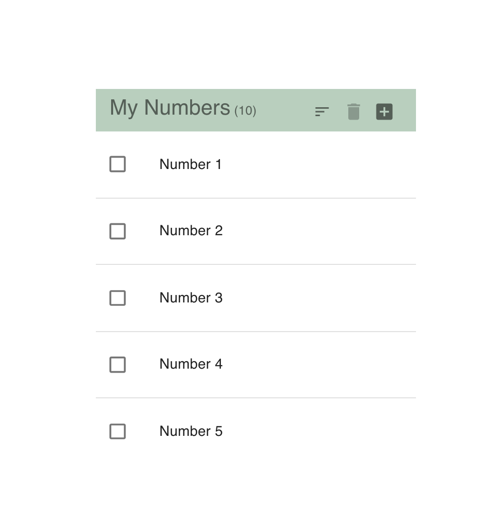
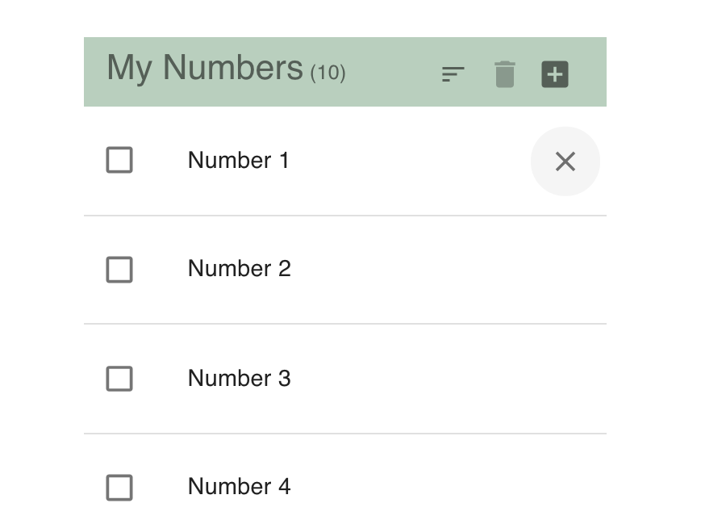
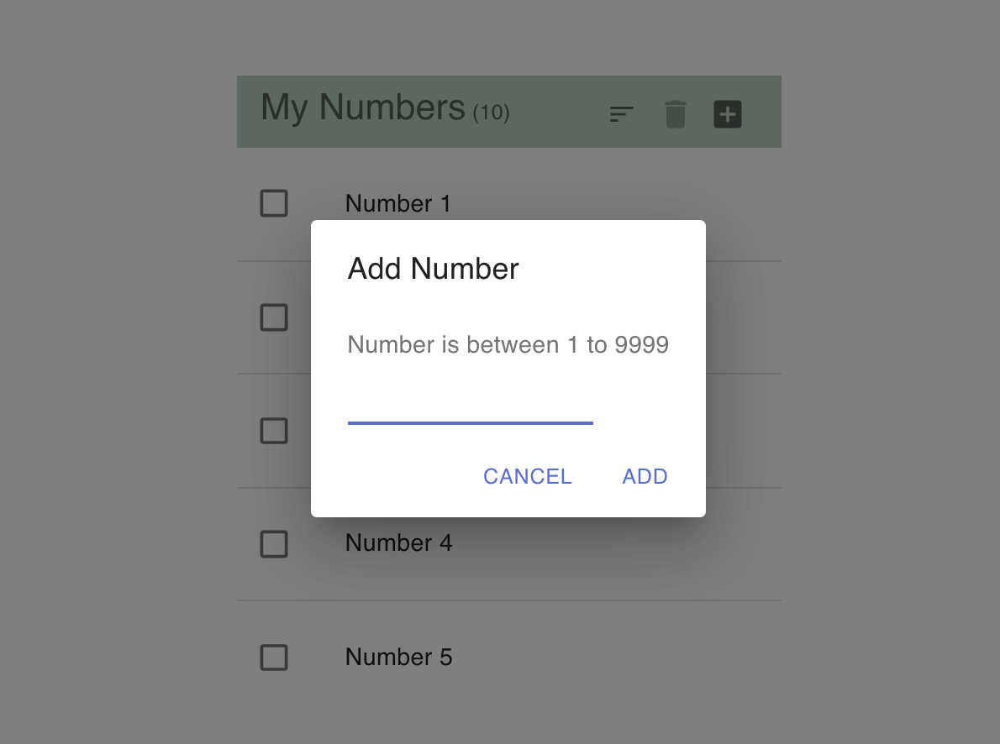

# React and Material UI exercise

User stories:
* Number List 
    - User can select numbers and delete them.
    - When hover on list item, delete icon will appear.  Clicking on the icon will delete the item.
    - There is a count number size in header.
    - Clicking on add icon will display Add Number dialog.

When Hover List Item

* Add Number Dialog
    - User can only enter 1 to 9999.
    - When no number or enter existing number, clicking on add button will show error.
    - If valid number, it will add to the list.
    - Clicking cancel will remove any error, clear the input and close dialog.

## Dependencies
- material-ui, react-text-mask.

## Access project

Can be accessed at https://explosivespectra.github.io/numberlist/
